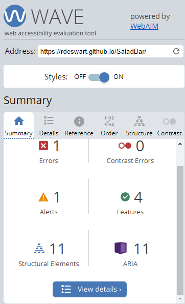

# SaladBar Website
SaladBar is a fictional Cafe that, as the name suggests, sells an array of salads. Their motto is to eat healthy and tasty food. The site's target audience is everyone who wants to adopt a healthier diet, people trying to lose weight and those who want to support local produce and services.
The website is a great place to view the current menus and if there are any special offers on. They will also be able to get in touch to order catering for parties or events.  

## Table of Contents:
* [User Experience](#user-experience-and-interface(UX/UI))
* [Design](#design )
* [Wireframe](#wireFrame)
* [Features](#features)
* [Testing](#testing)
* [Deployment](#deployment)
* [Credits](#credits)

## User Experience and Interface(UX/UI) 
#### First Time Visitor Goals  
+ As a first time visitor to the site, I want to be able to easily recognise what the business is about and who it is for.
+ The first time I use the site, I would like to be able to find it easy to navigate through the site to find more content using familiar web assets such as link placements and icons.
+ I would like to be able to see a menu of products being sold to see if they appeal to me and if they suit my dietary requirements.  
+ I would like to see where the cafe is situated and get directions.
#### Returning Visitor Goals  
+ As a returning visitor, I would like to check for any offers or promotions.
+ I would like to be able to check if the menu has changed or any new food items have been added.
+ I want to be able to find the best way to contact the business for a future party I want to host.
+ I would like to contact the business to leave some positive feedback.  
****
## Design  
### Colour Scheme
+ I chose to use a grey and very light pink for the SaladBar's colour scheme.
+ According to Noupe.com, "In summary, grey represents calm, sophistication, wisdom and is of course overarchingly architectural." which is the kind of positive emotion I am aiming for the site.
+ I wanted to use the softness of the lighter hue of pink to evoke feelings of comfort, warmth and nuture.  
### Typography
+ I used Poppins as the main font, with Sans-serif to fall back on, should Poppins not load properly in the
users browser. Poppins is a very popular and trendy font at the moment in web design due to its aesthetic and easy-readability.
## WireFrame
Keeping the 5 Planes, proposed by Jessie James Garrett, in mind, I used the Balsamic website to create the wireframe for the SaladBar website. Having decided on the Strategy, Scope and Structure planes, I set about planning its Skeleton and what would become my vision of the Surface Plane.
* Home Page WireFrame

* Menu Page WireFrame

* Contact Page WireFrame

## Features
#### Navigation
The pages navigation Bar is situated at the top of the screen, as most users would expect it to be.  It is identical on all pages. Having it displayed on all pages, prevents the need to use the back button.
  * The Links are situated on the top right of the page and will navigate the user to the Home Page, the Menu Page and the Contact Page.
    * The active page link has an underline and background colour for user clarity as to what page they are on at the moment.
  * The SaladBar name logo is situated on the top left of the page and is also a link back to the top of the Home Page if clicked.
#### Landing Page

The Home/Landing page sports an eye-catching, high contrast colour image of a salad as its hero image. The SaladBar's tagline "Where Healthy is Tasty" is also included as text overlay to further confirm to the user the content of the site.
  * About Us Section
    * The About us Section gives a brief description of the business, what they sell and also a link to the contact form page.
  Below that are some extra bullet points to note, in the form of images, to reduce reading time thus giving the user a more positive experience of learning about the business.
  * Promotion Section
    * The next section shows the cafe's current promotion with an eye-catching Gif for added animation and attention.
  * Information Section
    * The information section outlines the cafe's opening hours and a Google Map for directions to the shop.
  * Footer Section
    * The Footer, identical on each page, shares links to the SaladBar's social media sites for added engagement. When clicked, the links will open in a new tab to allow easy user navigation.  It also contains the site's name and copyright icon.
#### Menu Page

The Menu page will allow users to peruse through the SaladBar's selection of options available to eat. The dishes have been put into sensible sections eg.Salads, Pastas, Desserts for a more user friendly experience and each section uses the logo leaf to continue familiarity of the brand.
  * Each product has it's name and price clearly visible, and user's can click on the plus(+) button to drop down details of the dish i.e ingredients used.
This effectively reduces the page content significantly, which gives a more positive user experience than having to scroll through a long list of items.
  * There are three images displayed on the page, each relating to the dish heading. These images give the user an idea of the kind of high standard of food the SaladBar offers.
  * Under the menu section is a small promotion box used to upsell their large salads.
#### Contact Page

  
  The Contact page will allow users to fill out a clear and simple-to-use form with their information and space to add a brief message.  
  They will be required to check the terms and conditions box.
  
  There is also a section on how they came across our page, which is not a requirement to choose, but will help with our own data analysis. 
  Below the contact form is another copy of Google Map Section on where the shop is located.
  * When the user clicks the Submit button, they are brought to a Thank You page with a short message confirming their form has been received successfully.

## Future Features
  * Online ordering system
  * Check loyalty card points
  * Current job positions available
  * Make Images on main page clickable links to more info given
## Testing
The website has been tested on Google Chrome, Safari and Firefox and all rendered successfully.

  | Action: | Expected Result: | Pass/Fail: |
  |:---|:---|:---|
  | Enter URL/Click Link | Landing Page | Pass |
  | Form link in "About us" section | Contact Page | Pass |
  | Menu Page Link | Menu Page | Pass |
  | Click plus(+) button for more info | Dropdown box opens | Pass |
  | Contact Page Link | Contact Page | Pass |
  | No 1st Name added on form | Pop up message | Pass |
  | No last Name added on form | Pop up message | Pass |
  | No email added on form | Pop up message | Pass |
  | No T's & C's checked on form | Pop up message | Pass |
  | Dropdown media list on form | List of options | Pass |
  | Click Submit | Thank You message displays | Pass |
  | Tab Index for accessability | Tab through fields | Pass |
  | Double click on Google Maps | Zoom in to map | Pass |
  | Images broken filepath | See alt text | Pass |
## Validator Testing
  * HTML
    * No errors were returned when passing through the official [W3C validator](https://validator.w3.org/nu/#textarea)

  * CSS
    * No errors were returned when passing through the official [Jigsaw validator](https://jigsaw.w3.org/css-validator/)

  * Lighthouse
    * The website scored high when passed through Lighthouse 

  * Wave
    * The one error found when validating through [Wave](https://wave.webaim.org), was an empty label which was used for the nav toggle menu. I chose to leave it blank as it is a checkbox and  used instead of JavaScript to make the nav bar responsive and more aesthetic.

### Solved Bugs
* Form not submitting successfully
  * I put the form into seperate Div's and changed the ID to match the Submit Button.
* Parse error in CSS Validation
  * Move Google fonts link to bottom of Style Sheet.

### Unfixed Bugs
  * There are no unfixed bugs

## Deployment
The SaladBar site was deployed to GitHub pages. The steps to deploy are as follows:
1. In the GitHub repository, navigate to the Settings Tab.
2. From the source section drop-down menu, select the Master Branch.
3. Once this is selected, the page will be automatically refreshed with a detailed ribbon display to indicate successful deployment.
The live link can be found on GitHub [here](https://rdeswart.github.io/SaladBar)
## Credits
### Content
* Favicons: [Icons8 website](https://icons8.com/icon/XSG6KMba4zKy/salad)
* Icons for Logo & Footer: [Font awesome website](https://fontawesome.com)
* Google Maps: [Google Maps website](https://www.google.com/maps)
* Menu Content: [Holborn website](https://choppaluna.com/wp-content/uploads/2023/01/Holborn_FullMenu_StreetFacing_06-01-23.pdf)
and [Coco di Mama website](https://www.cocodimama.co.uk/menus/instore-menu/thehotlist)
* Instruction on how to embed Google Maps: [Jamie Juviler](https://blog.hubspot.com/website/how-to-embed-google-map-in-html)
* C.I Tutor Support - Tutor Roman helped me fix the footer and cleared my understanding of positioning.
* C.I Love Running - Help and Inspiration for Nav Bar
* Info on how to change the default details icon on menu page [Mdn Webdocs](https://developer.mozilla.org/en-US/docs/Web/HTML/Element/details)
### Media
* Images: [Free Images Website](https://www.freeimages.com/)
* Fonts: [Google Fonts website](https://fonts.google.com/)
* Sale Gif: [Giphy website](https://giphy.com/explore/free)

